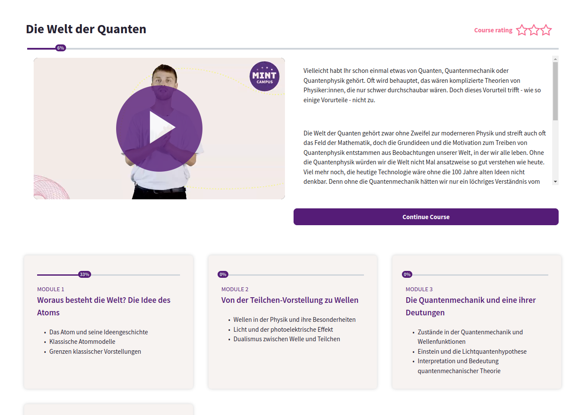
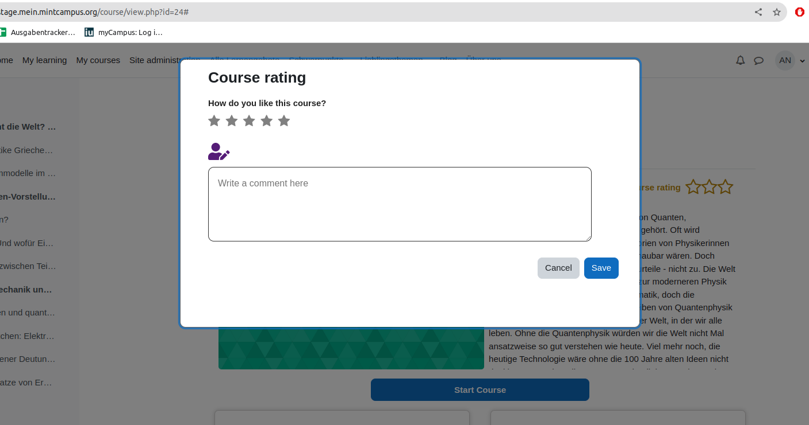
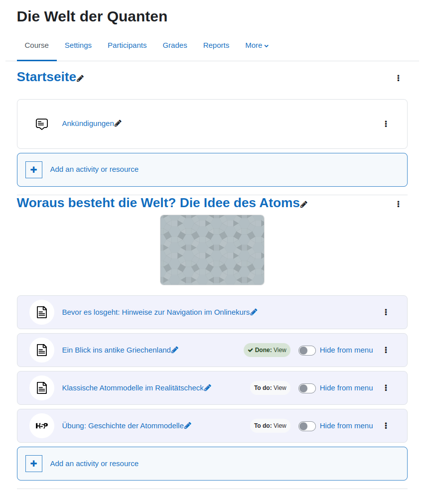
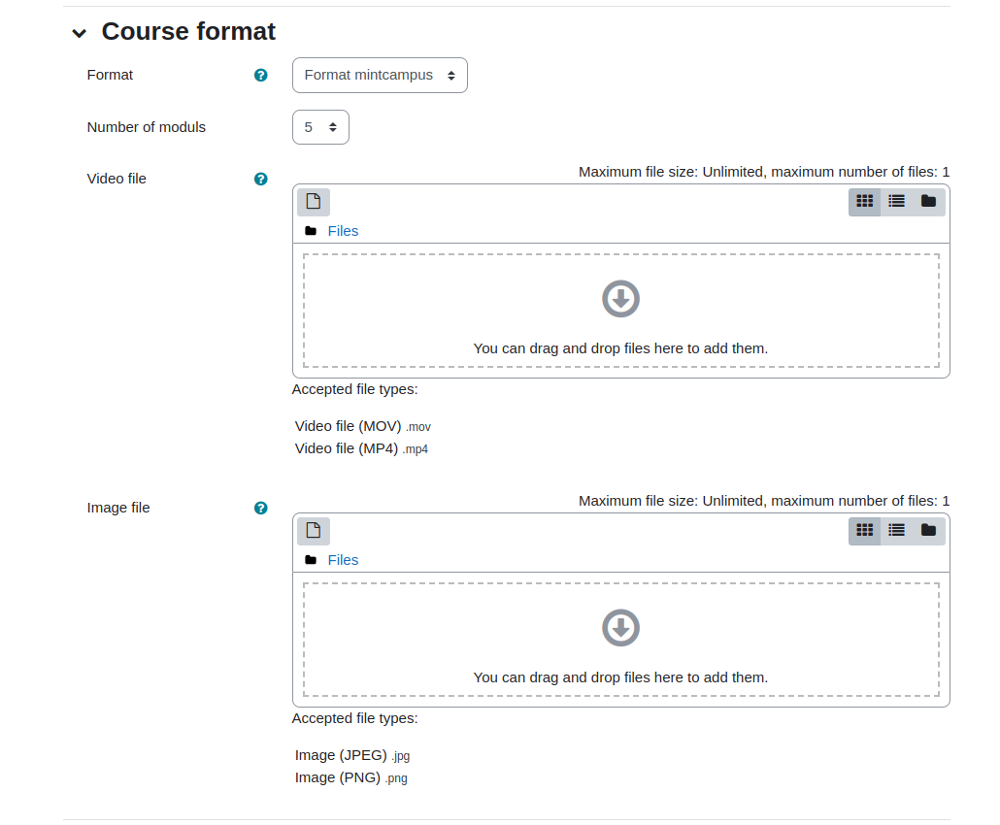

# MINTCampus Course Format

## Name
format_mintcampus

## Description
This course format plugin offers another way to experience a Moodle course. It has a compact design and a specific work 
flow, where each course section with learning contents turns to a standalone module with own tracked progress.

### Features of the format

- Introduction section with a teaser image/video and course description
- Course progress bar
- Forum section
- Course modules with own progress tracking. They allow to display up to 3 objectives / learning goals of a module.
- Start / Continue button bringing user to the next "ready to learn" activity
- Course rating pop up, aggregating users grade (from 1 to 5 stars) and feedback on a course. (Reporting is missing!)
- It's possible to force activities to disappear from side navigation on the left. For this a switch near a corresponding 
activity has to be turned on. The switch appears in the editing mode. 

## Installation
Pack format plugin in the moodle/course/format/ folder as mintcampus.

## Screenshots

