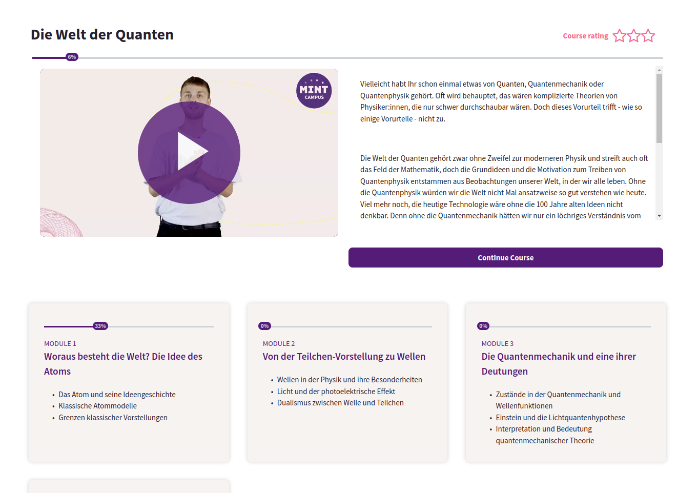
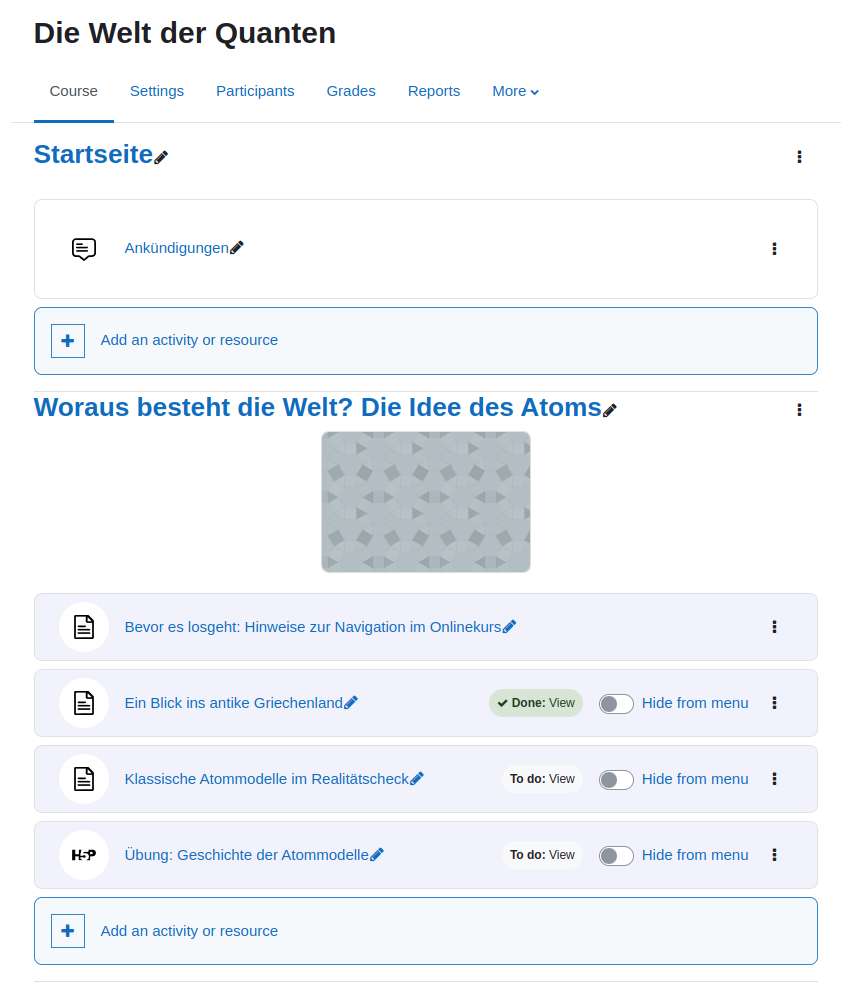

# MINTCampus Kursformat

## Name
format_mintcampus

## Beschreibung
Dieses Kursformat-Plugin bietet eine weitere Möglichkeit, einen Moodle-Kurs zu erleben. Es hat ein kompaktes Design und
einen eigenen Arbeitsablauf, bei dem jeder Kursabschnitt mit Lerninhalten zu einem eigenständigen Modul 
mit eigenem verfolgten Fortschritt wird.

### Merkmale des Formats

- Einführungsabschnitt mit einem Teaser-Bild/Video und einer Kursbeschreibung
- Kursfortschrittsbalken
- Forum-Abschnitt
- Kursmodule mit eigener Fortschrittskontrolle. Sie ermöglichen die Anzeige von bis zu 3 Lernzielen / -ergebnissen eines Moduls.
- Start-/Weiter-Schaltfläche, die den Benutzer zur nächsten "lernbereiten" Aktivität bringt
- Pop-up-Fenster für die Kursbewertung, in dem die Bewertung (von 1 bis 5 Sternen) und das Feedback des Benutzers zu einem Kurs zusammengefasst werden. (Berichte fehlen!)
- Es ist möglich, Aktivitäten aus der Seitennavigation auf der linken Seite verschwinden zu lassen. Dazu muss ein Schalter neben einer entsprechenden
  Aktivität eingeschaltet werden. Der Schalter erscheint im Bearbeitungsmodus.

## Installation
Packen Sie das Format-Plugin in den moodle/course/format/ Ordner als mintcampus.

## Screenshots

